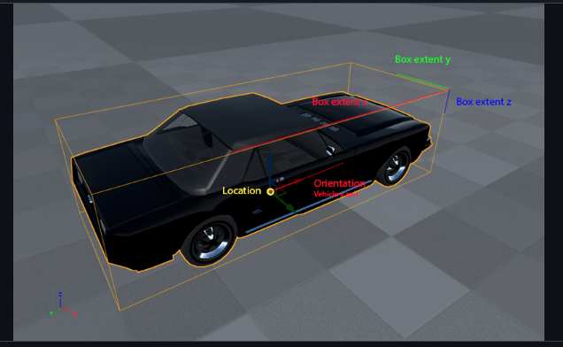

# Synthetic dataset creation

This folder contains the main scripts for the dataset creation. And we will describe how you can create your own ones using the different provided files.

## Start CARLA and record data

For this step you need two terminals. One that classically runs CARLA. Under linux it's the `./CarlaUE4.sh` that you run f.e.
In the second terminal you start `python3 experiment.py`. This start the script that spawns the main vehicle, sensors, the traffic and also starts the recording dependent on your set parameters

## Change parameters for the simulation

Inside of [experiment.py](./experiment.py) you find the at the bottom the following initialization of the experiment.

```python
if __name__ == '__main__':
    test_config = ExperimentConfig(
        "251114_eight_lidar_10s", 
        bridge_passive_mode=True,
        record=False,
        record_bboxes=True,
        duration_in_s=10,
        num_vehicles=300,
        num_walkers=10,
        town="Town15",
        host="winhost", # localhost for linux
    )
    runner = ExperimentRunner(test_config)
    runner.run_once()
```
Changing the parameters result in different experiments. The following list gives a short overview of the parameters and what they affect.
- `record` - Toggle recording of the sensors
- `record_bboxes` - Toggle recording of the actors bounding boxes
- `duration_in_s` - How long will the recording be (f.e. 10s at 20 fps will results in 200 frames of data)
- `num_vehicles` - Number of traffic vehicles that are spawned (each map has an upper bound that won't be exceeded)
- `num_walkers` - Number of pedestrians that are spawned (see `num_vehicles`)
- `town` - Which town is the recording performed in (Town15 was our desired town for experiments and recordings)

After recording a folder will be created under [data](../data/) named as the provided name, containing config files for the vehicle, metadata about the experiment and dependent on the toggles files containing bounding boxes for actors and static objects and/or a db folder containing the sensor data.

## Transforming the sensor data into .h5 and translating the coordinates

The data comes in usable `.db3` format but we decided we want to transform it into `.h5` so it's more usable for our object detection experiments. This is done automatically by running [data.py](./data.py). Just provide the right path to your `.db3` file and the rest will be taken care of.

```python
88    db_dir = Path(<Your Path>)
```

This script will also perform translations to the coordinates of the points cloud data as well as the two types of bounding boxes. Since this data is not recorded in respect to the ego vehicle but in respect to absolute world coordinates or specific sensors we need to perform a translation to guaranty consistency for later tasks like object detection etc.

The script will produce the following four .h5 files
- `lidar_data.h5`
- `lidar_ego_data.h5`
- `bbox_ego.h5`
- `bbox_static_ego.h5`

## Structure of the resulting .h5 files

The saved `.h5` files come with a specific structure that is described by the trees below
### Sensor data 
```
lidar_data.h5/lidar_ego_data.h5
    |_sensors
    |    |_frames
    |        |_points (x, y, z, cos, objidx, objtag)
    |_metadata

```
### Bounding box data
```
bbox_ego.h5
    |_actor_id_type_map
    |    |_(actor_id, actor_type) 
    |_frames
         |_ego
         |   |_(x,y,z, x_extent,y_extent,z_extent,roll,pitch 
         |    yaw)
         |_actors
             |_(actor_id, x,y,z, x_extent,y_extent,z_extent,roll,pitch,yaw)
             |_(actor_id, x,y,z, x_extent,y_extent,z_extent,roll,pitch,yaw)
             |_(actor_id, x,y,z, x_extent,y_extent,z_extent,roll,pitch,yaw)

```
## Data description

### lidar_data/sensors/frames/points
- (x, y, z):`(float, float, float)` are positional coordinates of the point in the ego vehicle coordinate space
- (cos):`(float)` is the incident
- (objidx, objtag):`(int, str)` are unique IDs for an object and the type of the object

### bbox/frames/ego
- (x, y, z):`(float, float, float)` are positional coordinates of the ego vehicle in the absolute world coordinate space
- (x extent, y extent, z extent):`(float, float, float)` are values describing the size of the bounding box around ego vehicle in combination the coordinates
- (roll, pitch, yaw):`(float, float, float)` is the rotation information of the ego vehicle in the absolute world coordinate space

## bbox/frames/actors
- (actor_id):`(int)` unique identifier for actors
- (x, y, z):`(float, float, float)` are positional coordinates of the actor in the ego vehicle coordinate space
- (x extent, y extent, z extent):`(float, float, float)` are values describing the size of the bounding box around actor in combination the coordinates
- (roll, pitch, yaw):`(float, float, float)` is the rotation information of actor in the ego vehicle coordinate space

## bbox/actor_types
- (actor_id):`(int)` unique identifier for actors
- (actor_type):`(str)` type of actor corresponding to the ID

